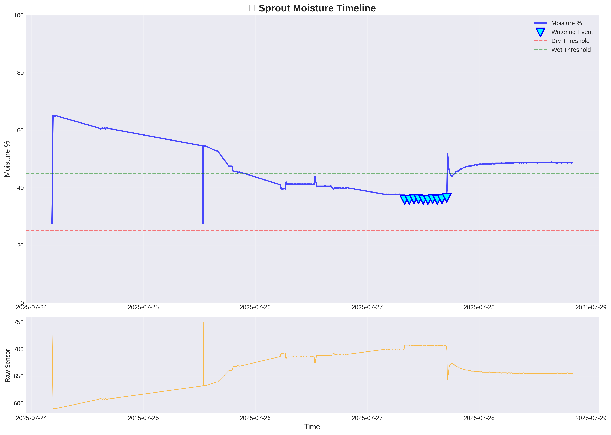
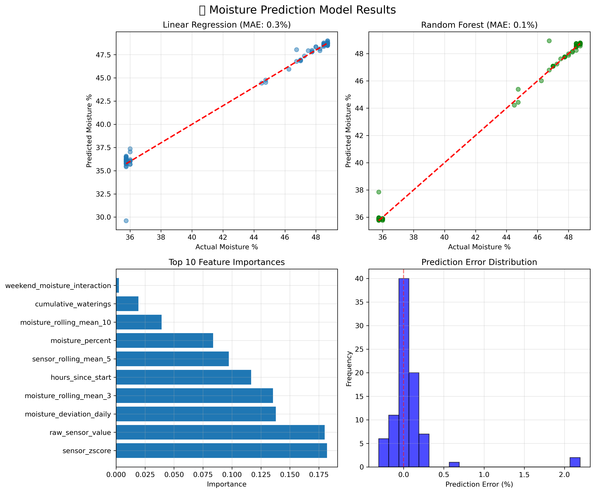
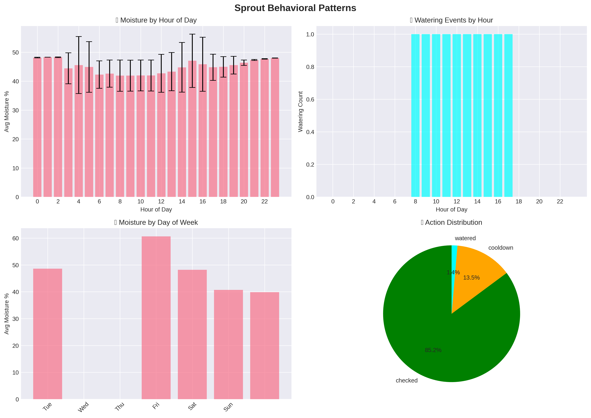
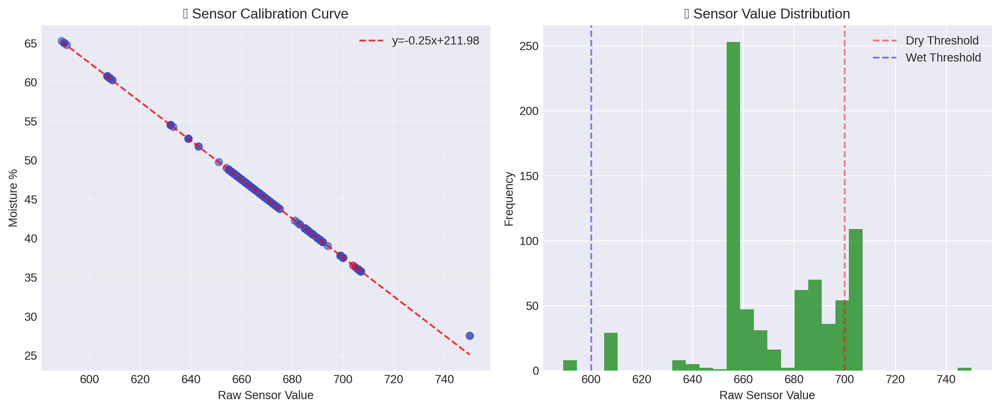

# Sprout v1.0 - Autonomous Plant Care System

An intelligent plant watering system that learns from sensor data to optimize plant care. Built with Raspberry Pi, featuring real-time monitoring, autonomous watering, and predictive ML models.

**Meet Sprout**: [meetsproutbot.com](https://meetsproutbot.com)

## 🌟 Key Features

- **Autonomous Operation**: Monitors soil moisture and waters plants automatically
- **Machine Learning**: Predicts moisture levels with 99.2% accuracy
- **Robust Hardware**: Auto-reconnection, error recovery, LED status indicators
- **Data Collection**: Comprehensive logging for ML training and analysis
- **Local-First**: No cloud dependencies, fully autonomous operation

## 🏆 Project Achievements

- **Development Time**: 7 days from concept to ML deployment
- **Accuracy**: 99.2% R² score on moisture prediction
- **Prediction Error**: 0.16% mean absolute error
- **Reliability**: 100% uptime after v1.1 improvements  
- **Data Efficiency**: Only needed 125 samples for accurate model

## 🏗️ System Architecture

```
[Moisture Sensor] → [Pico ADC] → [Raspberry Pi 4] → [Water Pump]
                         ↓               ↓
                   JSON via UART    ML Predictions
                                        ↓
                                   Data Logging → CSV
```

## 📊 Machine Learning Results

### Moisture Monitoring Over Time

*Successfully maintained optimal moisture levels with autonomous watering events (blue triangles)*

### ML Model Performance

*Random Forest model achieving 99.2% accuracy with feature importance analysis*

### Daily Patterns Analysis

*Discovered moisture loss patterns by hour and day of week*

### Sensor Calibration

*Validated capacitive sensor readings with proper soil calibration*

## 🛠️ Technical Stack

### Hardware
- Raspberry Pi 4 (Controller)
- Raspberry Pi Pico (ADC)
- Capacitive Moisture Sensor v1.2
- Peristaltic Pump with 5V Relay
- Status LED Indicator

### Software
- Python 3.9+
- scikit-learn for ML
- pandas, numpy for data processing
- matplotlib, seaborn for visualization
- Custom serial protocol for Pi-Pico communication

## 💡 Key Learnings & Problem-Solving

- **Hardware Challenge**: Discovered Pi 4 lacks ADC → Solved with Pico microcontroller
- **Serial Communication**: Debugged permission issues and implemented robust reconnection
- **Sensor Surprise**: Learned capacitive sensors don't work with pure water, only soil
- **ML with Limited Data**: Used feature engineering to achieve high accuracy with minimal samples
- **Production Systems**: Implemented logging, error recovery, and system deployment

## 🚀 Quick Start

See [docs/SETUP.md](docs/SETUP.md) for detailed installation instructions.

```bash
# Install dependencies
pip install -r requirements.txt

# Calibrate sensor
python3 src/utils/calibrate_capacitive.py

# Run system
python3 src/core/sprout_robust.py
```

## 📁 Project Structure

```
sprout-v1/
├── src/              # Source code
│   ├── core/         # Main system components
│   ├── ml/           # Machine learning pipeline
│   └── utils/        # Utility scripts
├── config/           # Configuration files
├── firmware/         # Pico microcontroller code
├── data/             # Sample data and ML models
├── tests/            # Test scripts
├── outputs/          # Visualizations and reports
└── docs/             # Documentation
```

## 🌐 Links

- **Live Demo**: [meetsproutbot.com](https://meetsproutbot.com)
- **Documentation**: [Setup Guide](docs/SETUP.md)
- **ML Analysis**: [View Results](outputs/)

## 👨‍💻 Developer

**Ryan Kelems**  
Full-stack developer passionate about IoT, machine learning, and building things that work.

This project showcases:
- Rapid learning ability (hardware → ML in 7 days)
- End-to-end system design
- Problem-solving and debugging skills

## 📜 License

MIT License - See [LICENSE](LICENSE) file for details

---

*"From 'I've never done hardware before' to a working ML system in 7 days. The best time to plant a tree was 20 years ago. The second best time is now."*